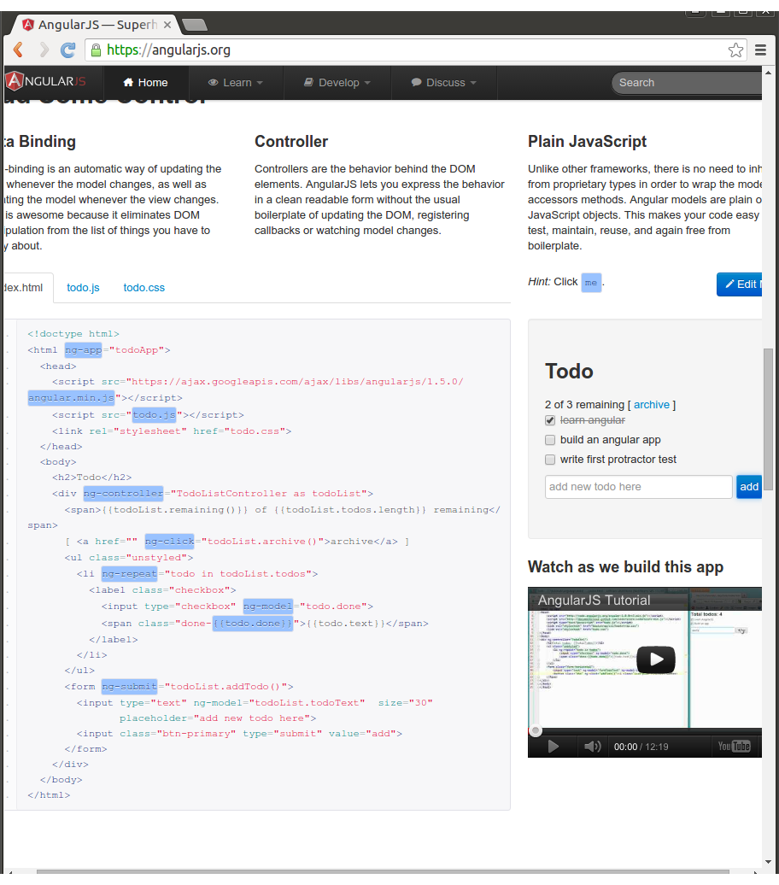

## To run this test, execute:

```bash
export PATH="./node_modules/.bin:$PATH"
npm install protractor
webdriver-manager update
webdriver-manager start &
protractor conf.js
```

## You should see:

```
Using the selenium server at http://localhost:4444/wd/hub
[launcher] Running 1 instances of WebDriver
Started
.
```



```
1 spec, 0 failures
Finished in 4.077 seconds
[launcher] 0 instance(s) of WebDriver still running
[launcher] chrome #1 passed
```

